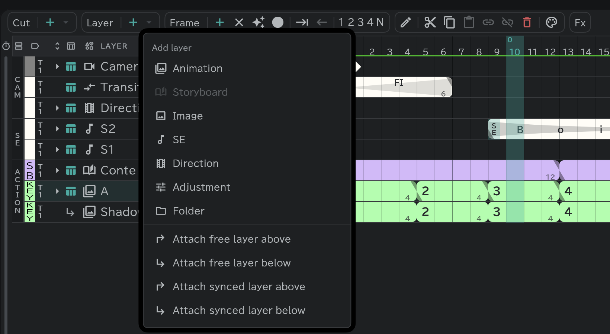

# Attach layers

A layer attached to a base layer: it follows the base's movement and effects, and keeps its own drawings. Use it for shadows and highlights.

- Select the base layer and, from **Layer ＋ ▾**, pick a **synced** or **free** attach layer above or below.
- **Synced**: follows the base's timing as it is.
- **Free**: has its own timing.
- [Exported](/en/export) as cels, it comes out composited with its base.
