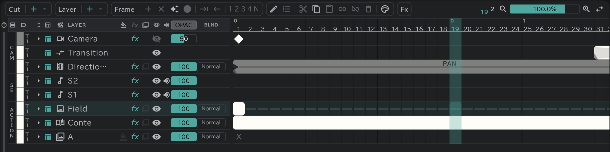

# Camera, direction, transition

The **CAM** section at the top of the timeline holds camera work and scene changes.

- **Camera**: keyframes (◆) set the camera's position, zoom and rotation. The canvas, playback and export move by them.
- **Transition**: scene changes such as FI, FO and O.L (the kind is changed with the [Edit button](/en/timeline?id=the-edit-button)) — the canvas and playback show them too.
- **Direction**: instructions such as PAN, T.U and T.B, written as blocks. They are notation for the sheet and move nothing on screen.
- All three are written into the CAM columns of the [timesheet](/en/sheets) at once.
