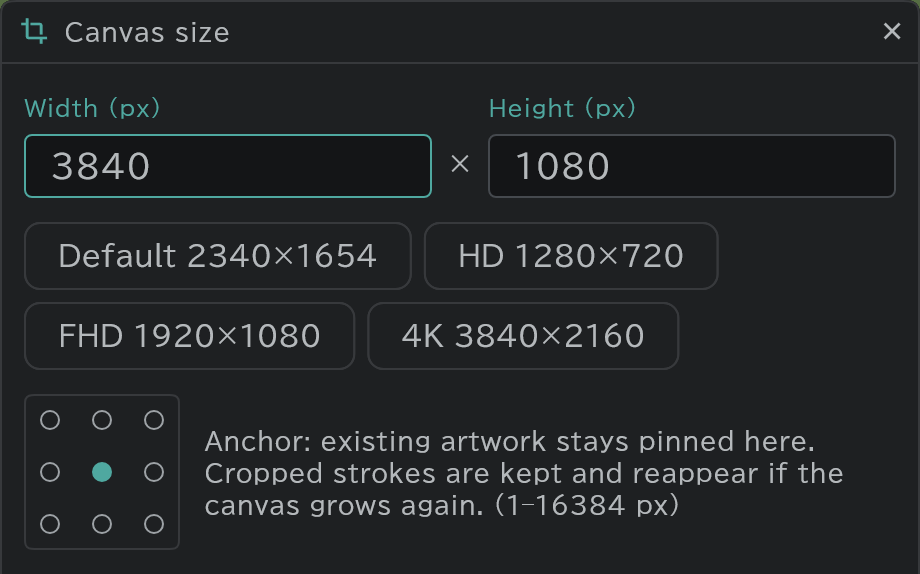

# Canvas size per cut

Each cut can have its own canvas size — make only the cut with the long pan background wide, for example.

- Press **Cut** at the top of the timeline → **Canvas size**. It applies to the current cut only.
- Set the width and height, and pick the anchor the existing drawing stays fixed to.
