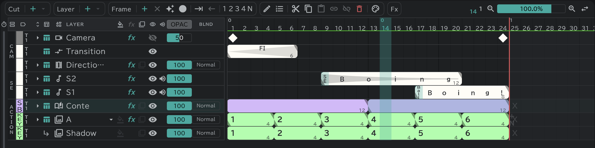

# Conte layer

The layer a cut's conte is drawn on — one per cut.

- Add it with **Layer ＋ ▾ → Storyboard**, or make it with the **＋** button on a cut block in the [conte](/en/storyboard) panel.
- One block is one picture on the [conte sheet](/en/sheets). **Frame ＋** inside a block divides it there.
- It has no empty cells: a block runs on to the next block or the end of the cut.
- Draw on the canvas, or straight onto the conte sheet.
