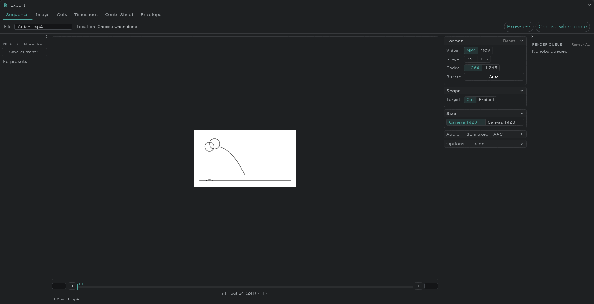

# Export

**Project** (folder) at the top left → **Export…** exports from one window.

- Tabs: **Sequence** (movie, numbered images) · **Image** · **Cels** · **Timesheet** · **Conte Sheet** · **Envelope**
- The range (cut / project) and the size (camera / canvas) are chosen per tab.
- Movies carry the sound on the SE rows.
