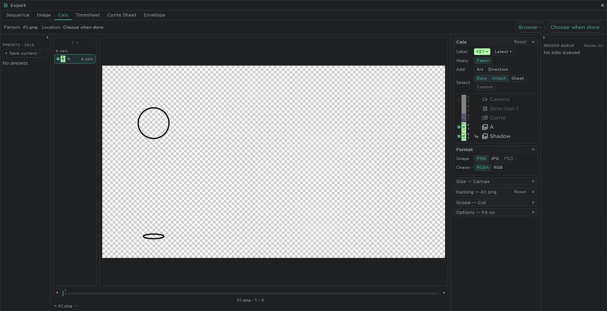

# Export

**Project** (folder) at the top left → **Export…** exports from one window.

- Tabs: **Sequence** (movie, numbered images) · **Image** · **Cels** · **Timesheet** · **Conte Sheet** · **Envelope**
- The range (cut / project) and the size (camera / canvas) are chosen per tab.
- Movies carry the sound on the SE rows.

## Cels

Each drawing goes out as one file (PNG, JPG or PSD).

- A file is named by its layer and the drawing's number (e.g. `A1.png`); digits, a suffix and folders are set under **Naming**.
- An [attach layer](/en/attach-layers) comes out composited with its base, as one picture.
- [Colour labels](/en/layer-labels) and takes pick what goes out (e.g. only the latest take of the keys).
