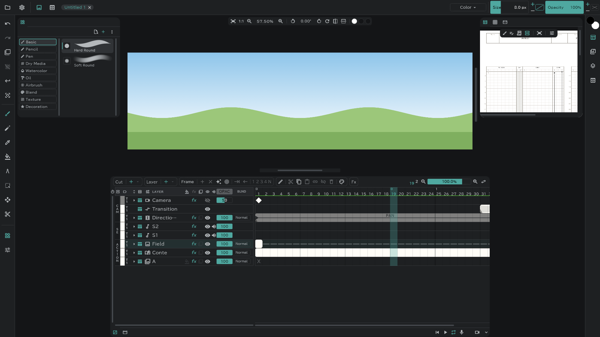

# Image layers

Place an image — a background, say — as a layer.

- **Project** (folder) at the top left → **Import / Place…**, pick an image, and the current cut gets an image layer.
- The file is registered in the [media pool](/en/media-pool) too.
