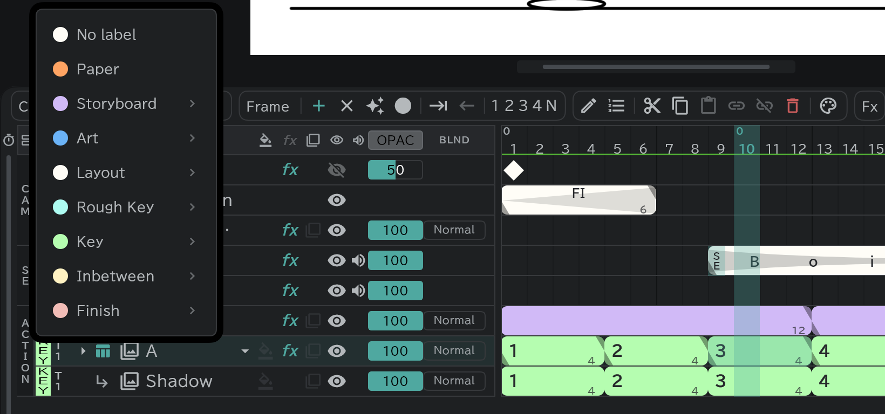

# Colour labels

Give each layer its stage (storyboard, layout, key, inbetween and so on) and its row and frame blocks take that colour.

- Press the label slot at the far left of a row and pick the stage. **▸** offers Material and revision stages such as Direction and Animation Director.
- Which stage a drawing is at reads at a glance on the timeline.
