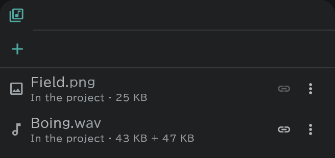

# Media pool

Where the images, sounds and movies you bring in are kept.

- Open it with the **Media** button on the bar at the right edge. **＋** only registers files.
- Place a file with **⋮ → Place…** on its row, or by dragging it onto the timeline.
- **In the project** means the file is kept inside the project file; **Linked** means it points to a file outside.
