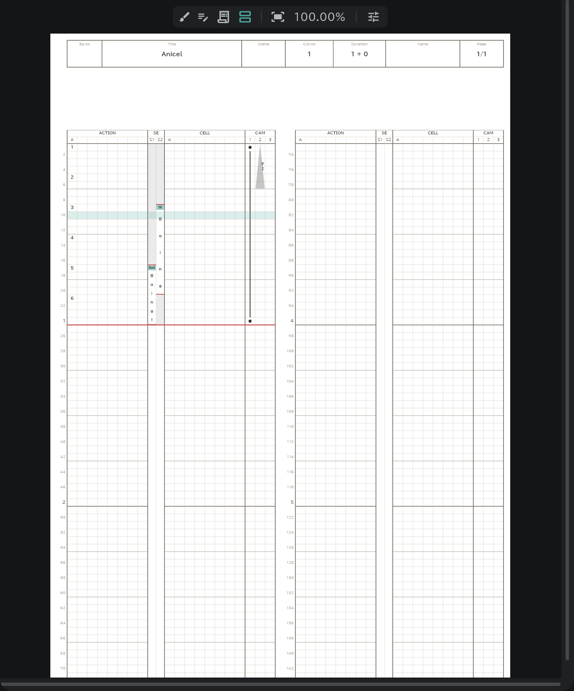
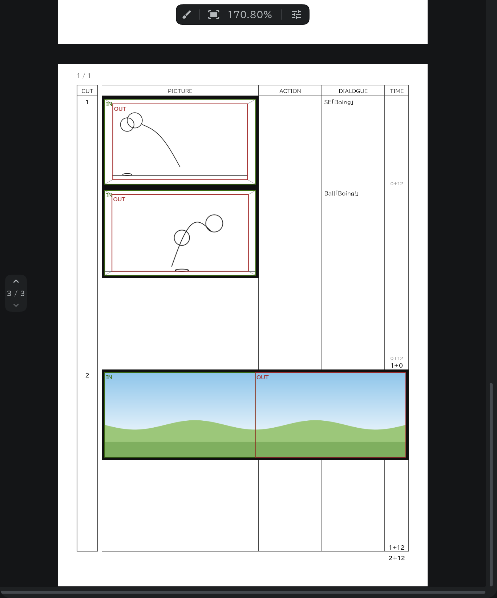

# Timesheet & conte sheet

Every edit shows at once, and you see — live — exactly what will be printed.

- Pick **Timesheet** or **Conte Sheet** from the tabs at the top of the panel on the right.
- Change a drawing, a line of dialogue or the camera on the timeline, and the sheet is written on the spot.
- It [exports](/en/export) as you see it.
