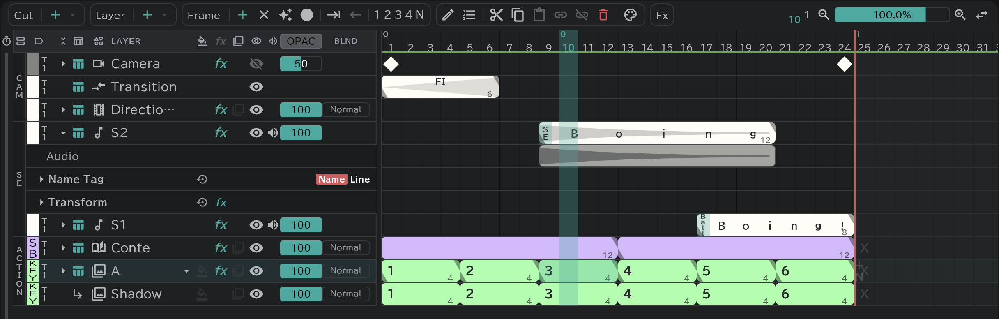

# Sound layers

Put sound on an SE row and time the drawings against its waveform.

- **Project** (folder) at the top left → **Import / Place…** places a sound file.
- Open the row with **▸** at its left to see the waveform.
- An SE block's name and dialogue go in through the [Edit button](/en/timeline?id=the-edit-button), and are written onto the [timesheet and conte sheet](/en/sheets) as they are.
