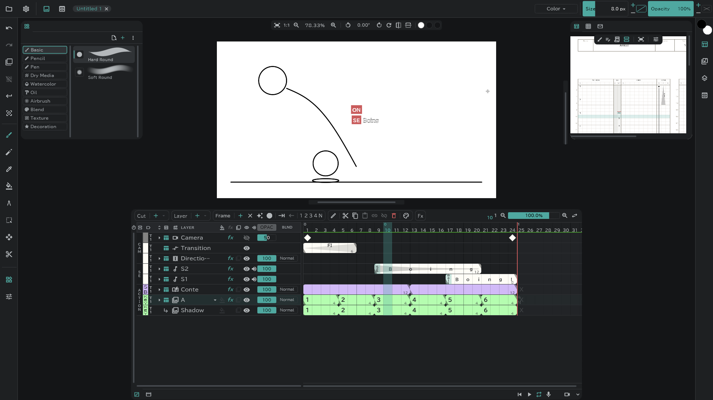
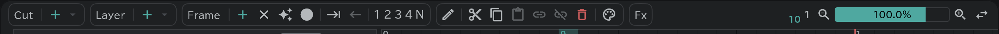

# Getting started

Using a short bouncing ball as the example, this is only what you need to start drawing.

## Cuts and layers

- At the top of the timeline, **Cut ＋** makes a cut and **Layer ＋** makes a drawing layer.

## Frames

- Pick a cell on a layer's row and press **Frame ＋** — a drawing appears there.
- With **✦** (Make a frame where there is none) on, drawing on an empty cell makes one by itself.

## Drawing

- Pick the brush on the tool bar at the left and draw on the canvas. Brush types are in the list at the top left.
- Size and opacity are at the top right of the window.

## Play and save

- **▶** at the bottom right of the timeline plays.
- The **Project** (folder) button at the top left → **Save** saves.
