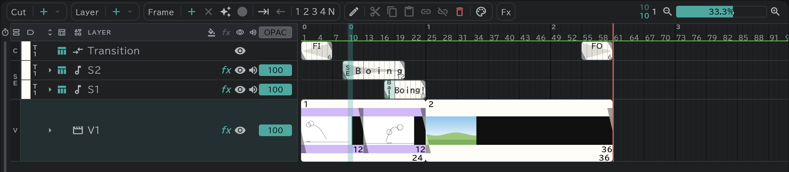

# Conte

Draw the conte and it already is the cut — the timeline works on that cut.

- On the **Conte** tab at the bottom left of the panel, the cuts line up in time as blocks, each showing its conte. **▶** here plays every cut in a row.
- On the [conte sheet](/en/sheets) you draw straight onto the paper: turn on **Allow Brush** at the top of the sheet and draw in a cell's picture — it becomes that cut's conte.
- With **✦** (Make a frame where there is none) on, drawing on the empty row after the last cut makes the next cut.
