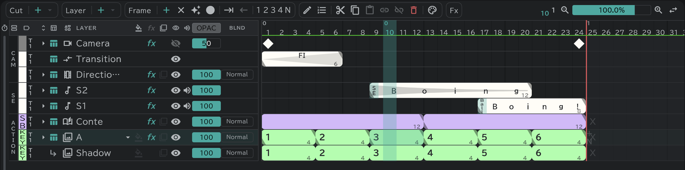
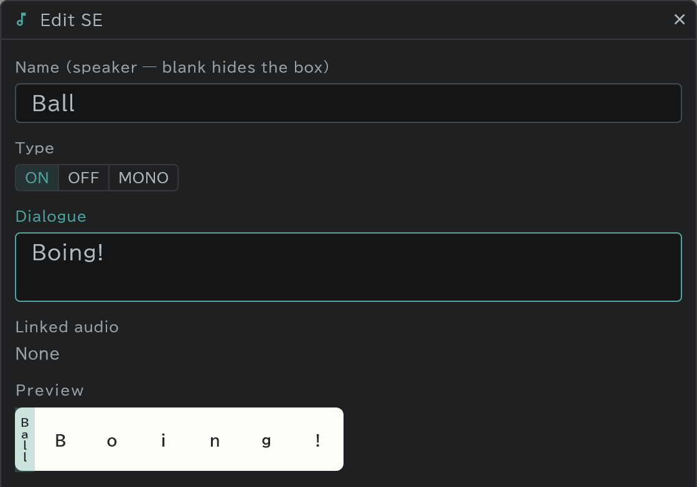

# Timeline

One row is one layer; across is time, in frames.

- From the top: **CAM** (camera, transition, direction), **SE** (sound, dialogue), then **ACTION**, the drawing layers.
- One block is one drawing. The big number is the drawing's name; the small number at the block's end is the block's length in frames.
- The colour at the left of a row is its [colour label](/en/layer-labels).
- The tabs at the bottom left of the panel switch between the timeline and the [conte](/en/storyboard).

## Selecting and moving

Frames, layers and the cut blocks of the [conte](/en/storyboard) panel all work the same way.

- The first drag **selects** (one or several).
- A drag that starts on the selection **moves** it.

## The Edit button

Select a block and press **✎** (Edit) at the top: the window for what you selected opens. A double click on the block does the same.

- A drawing's block (drawing, conte and image layers): the drawing's name
- An SE block: the name (speaker) and dialogue, the type (ON · OFF · MONO), the linked audio
- A direction block: the instruction (PAN and so on)
- A transition block: the kind of change (FI, FO and so on). Its length is changed by dragging the block's end.
- A key on a lane, such as the camera's: the key's name
- With layers selected, their name (several at once); with cuts selected in the [conte](/en/storyboard) panel, the cut's name
