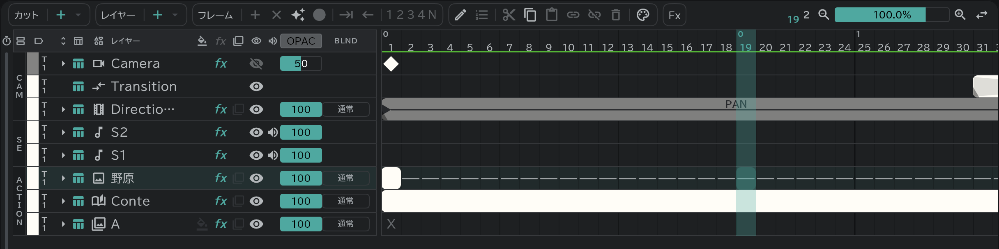

# カメラ・ディレクション・トランジション

タイムライン最上部の **CAM** 区画で、カメラワークと画面転換を扱います。

- **カメラ**:キーフレーム(◆)でカメラの位置・拡大・回転を決めます。カンバス・再生・書き出しがそのとおりに動きます。
- **トランジション**:FI・FO・O.L などの画面転換を入れます(種類は[編集ボタン](/ja/timeline?id=編集ボタン)で変えます)。カンバスと再生にもそのまま見えます。
- **ディレクション**:PAN・T.U・T.B などの指示をブロックで書きます。シートに書く表記なので、画面は動かしません。
- どれも[タイムシート](/ja/sheets)の CAM 欄にすぐ記入されます。
