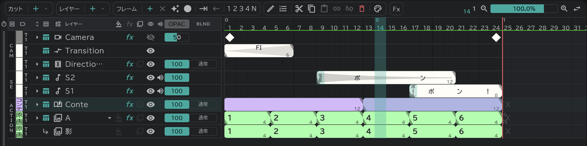

# コンテレイヤー

カットのコンテを描くレイヤーです。カットごとにひとつ置きます。

- **レイヤー ＋ ▾ → 絵コンテ** で追加するか、[コンテ](/ja/storyboard)パネルでカットブロックの **＋** ボタンから作ります。
- ブロックひとつが[コンテ用紙](/ja/sheets)の画面ひとつです。ブロックの中で **フレーム ＋** を押すと、そこで画面が分かれます。
- 空きコマはありません。ブロックは次のブロックかカットの終わりまで続きます。
- カンバスで描くか、コンテ用紙に直接描きます。
