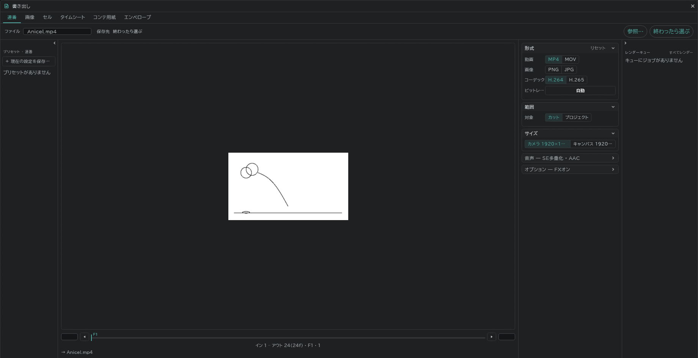
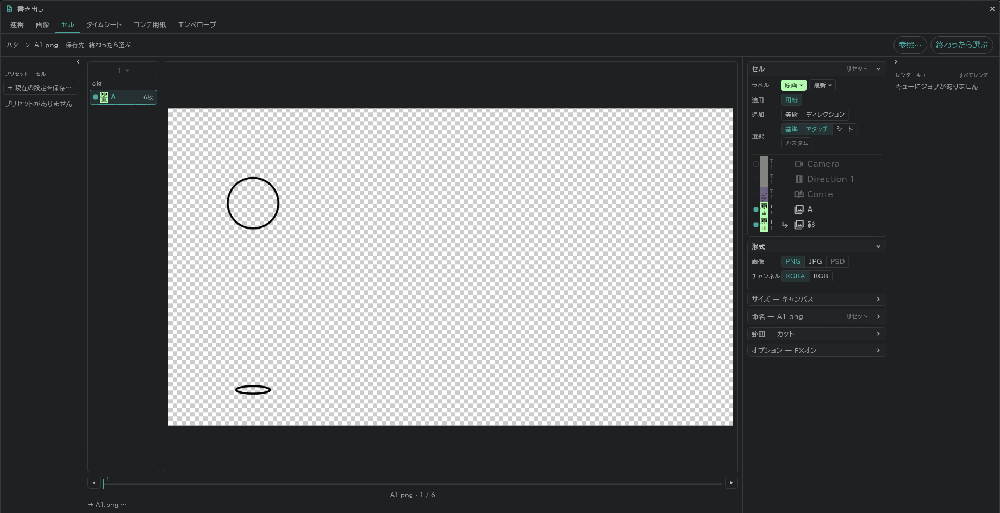

# 書き出し

左上の **プロジェクト**(フォルダ) → **書き出し…** から、ひとつの画面で書き出します。

- タブ:**連番**(動画・連番画像) · **画像** · **セル** · **タイムシート** · **コンテ用紙** · **エンベロープ**
- 範囲(カット/プロジェクト)とサイズ(カメラ/キャンバス)は、タブに応じて選びます。
- 動画には SE の行の音も一緒に入ります。

## セル

絵一枚をファイル一枚(PNG・JPG・PSD)で書き出します。

- ファイル名はレイヤー名と絵の番号です(例:`A1.png`)。桁数・接尾辞・フォルダは **命名規則** で選びます。
- [アタッチレイヤー](/ja/attach-layers)は、本体と重ねた一枚で出ます。
- [カラーラベル](/ja/layer-labels)とテイクで選び出します(例:原画の最新テイクだけ)。
