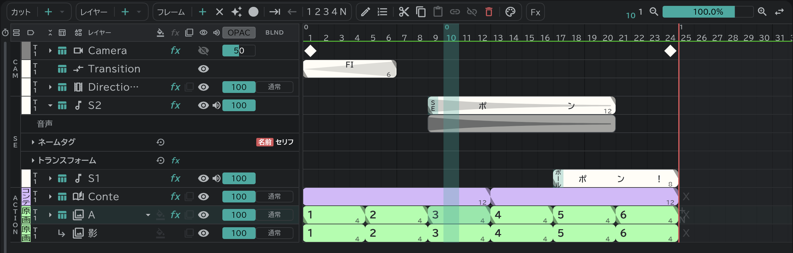

# サウンドレイヤー

音を SE の行に置き、波形を見ながら絵とタイミングを合わせます。

- 左上の **プロジェクト**(フォルダ) → **読み込み／配置…** で音のファイルを置きます。
- 行の左の **▸** で開くと波形が見えます。
- SE のブロックの名前・セリフは[編集ボタン](/ja/timeline?id=編集ボタン)で入れ、[タイムシート・コンテ用紙](/ja/sheets)にそのまま記入されます。
