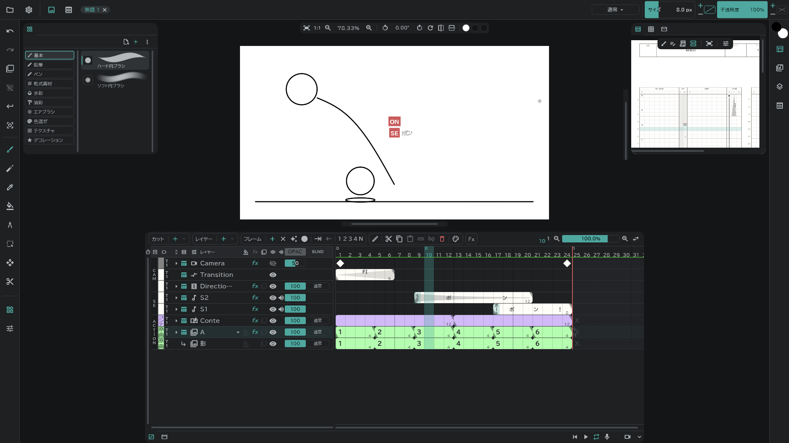
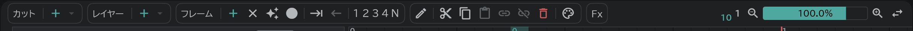
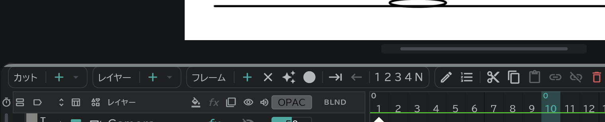
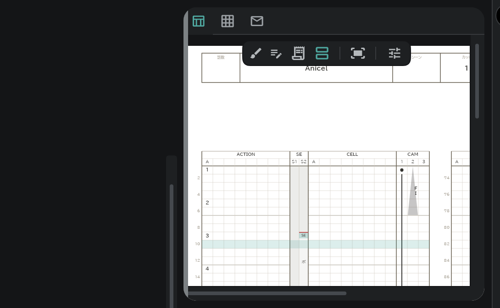

# はじめに

ボールが跳ねる短い場面を例に、描くまでに必要なことだけをまとめます。

## カットとレイヤー

- タイムライン上部の **カット ＋** でカットを、**レイヤー ＋** で作画レイヤーを作ります。

## フレーム

- レイヤーの行でコマを選び、**フレーム ＋** を押すと、そこに絵ができます。
- **✦**(空のセルに描いたらフレームを作る)をオンにしておけば、空いたコマに描くだけでできます。

## 描く

- 左のツールバーでブラシを選び、カンバスに描きます。ブラシの種類は左上のリストから選びます。
- サイズと不透明度は画面右上で変えます。

## 再生と保存

- タイムライン右下の **▶** で再生します。
- 左上の **プロジェクト**(フォルダ)ボタン → **保存** で保存します。

## パネルの大きさ

パネルの縁をドラッグすると大きさが変わります。マウスを乗せると、その縁が明るくなります。

- 下のパネル(タイムライン・コンテ):カンバス側の縁で高さ、左右の縁で幅。左右の縁をダブルクリックすると既定の幅に戻ります。

- 横のパネル:カンバス側の縁で幅、下の縁で高さ。同じ側のパネルは幅をいっしょに使います。
