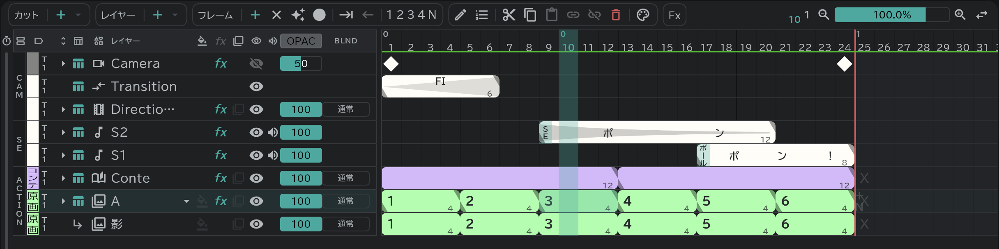
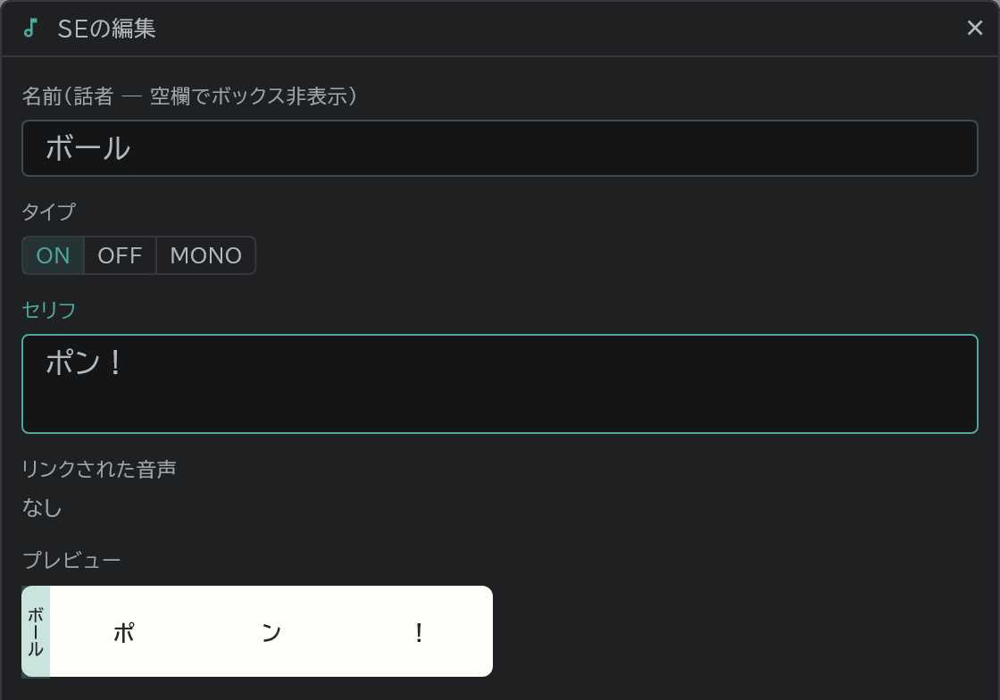

# タイムライン

一行がひとつのレイヤー、横が時間(フレーム)です。

- 上から **CAM**(カメラ・トランジション・ディレクション)、**SE**(音・セリフ)、その下の **ACTION** が作画レイヤーです。
- ブロックひとつが絵一枚です。大きい数字は絵の名前、ブロックの端の小さい数字はそのブロックの長さ(フレーム数)です。
- 行の左の色は[カラーラベル](/ja/layer-labels)です。
- パネル左下のタブで、タイムラインと[コンテ](/ja/storyboard)を切り替えます。

## 編集ボタン

ブロックを選んで上の **✎**(編集)を押すと、選んだものに合った画面が開きます。ブロックをダブルクリックしても同じです。

- 絵のブロック(作画・コンテ・画像レイヤー):絵の名前
- SE のブロック:名前(話者)・セリフ、タイプ(ON・OFF・MONO)、リンクされた音声
- ディレクションのブロック:指示(PAN など)
- トランジションのブロック:転換の種類(FI・FO など)。長さはブロックの端をドラッグして変えます。
- カメラなどのレーンのキー:キーの名前
- レイヤーを選べばレイヤー名(複数まとめて)、[コンテ](/ja/storyboard)パネルでカットを選べばカット名
