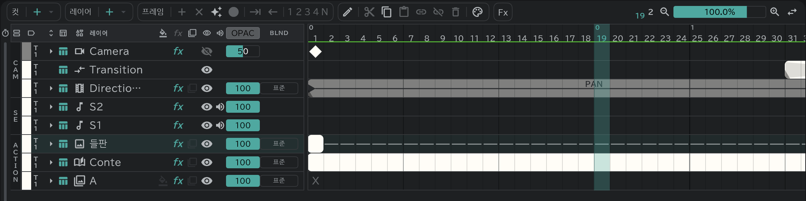

# 카메라·디렉션·트랜지션

타임라인 맨 위 **CAM** 구역에서 카메라워크와 화면 전환을 다룹니다.

- **카메라**: 키프레임(◆)으로 카메라의 위치·확대·회전을 정합니다. 캔버스·재생·출력이 그대로 움직입니다.
- **트랜지션**: FI·FO·O.L 같은 화면 전환을 넣습니다. 캔버스와 재생에도 그대로 보입니다.
- **디렉션**: PAN·T.U·T.B 같은 지시를 블록으로 적습니다. 시트에 적는 표기라 화면을 움직이지는 않습니다.
- 셋 다 [타임시트](/ko/sheets)의 CAM 칸에 바로 찍힙니다.
