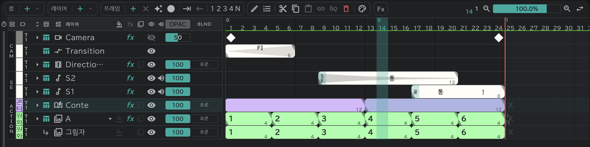

# 콘티 레이어

컷의 콘티를 그리는 레이어입니다. 컷마다 하나씩 둡니다.

- **레이어 ＋ ▾ → 콘티** 로 추가하거나, [콘티](/ko/storyboard) 패널에서 컷 블록의 **＋** 버튼으로 만듭니다.
- 블록 하나가 [콘티 용지](/ko/sheets)의 한 칸입니다. 블록 안에서 **프레임 ＋** 를 누르면 그 자리에서 칸이 나뉩니다.
- 빈 칸이 없습니다. 블록은 다음 블록이나 컷 끝까지 이어집니다.
- 캔버스에서 그리거나, 콘티 용지에 바로 그립니다.
