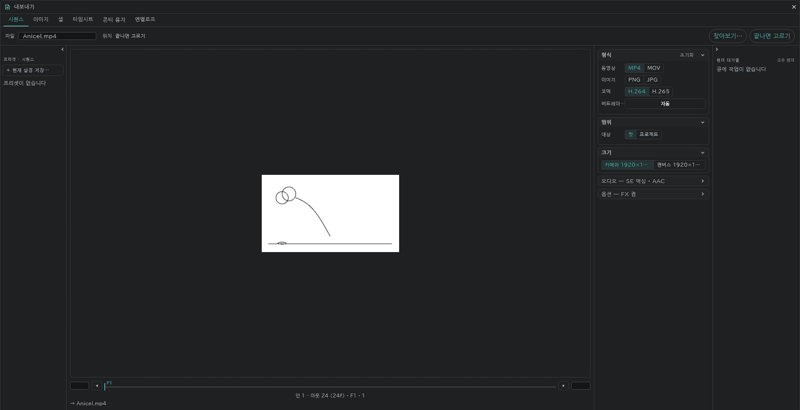
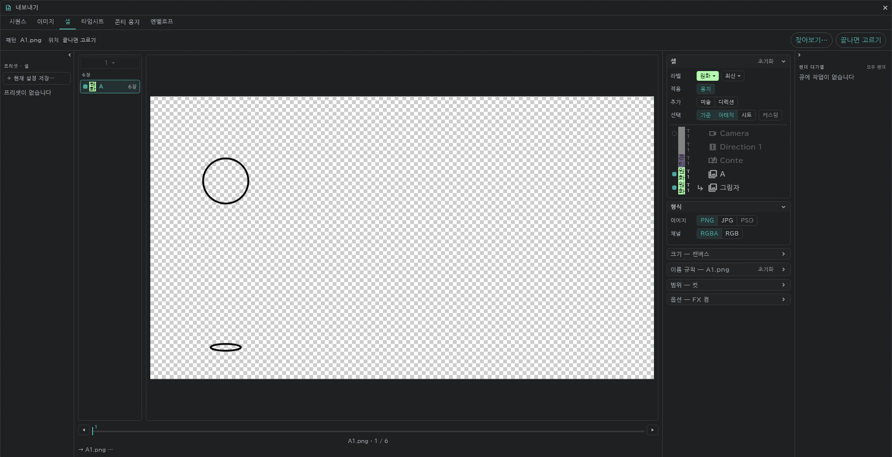

# 출력

왼쪽 위 **프로젝트**(폴더) → **내보내기…** 에서 한 창으로 출력합니다.

- 탭: **시퀀스**(동영상·연번 이미지) · **이미지** · **셀** · **타임시트** · **콘티 용지** · **엔벨로프**
- 범위(컷/프로젝트)와 크기(카메라/캔버스)는 탭에 따라 고릅니다.
- 동영상에는 SE 줄의 소리가 함께 들어갑니다.

## 셀

그림 한 장을 파일 한 장(PNG·JPG·PSD)으로 냅니다.

- 파일 이름은 레이어 이름과 그림 번호입니다(예: `A1.png`). 자릿수·접미사·폴더는 **이름 규칙** 에서 고릅니다.
- [어태치 레이어](/ko/attach-layers)는 본 레이어와 합쳐진 한 장으로 나옵니다.
- [색 라벨](/ko/layer-labels)과 테이크로 골라 냅니다(예: 원화의 최신 테이크만).
