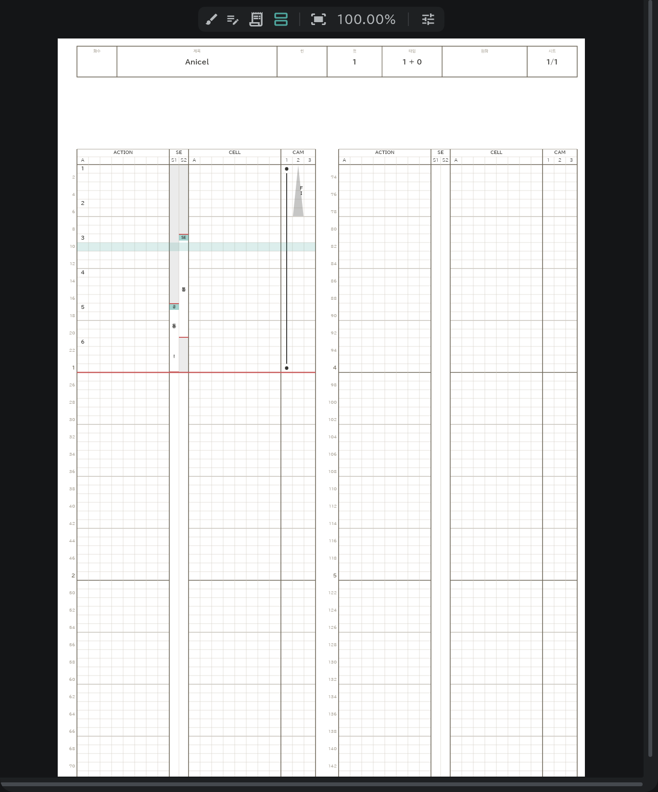
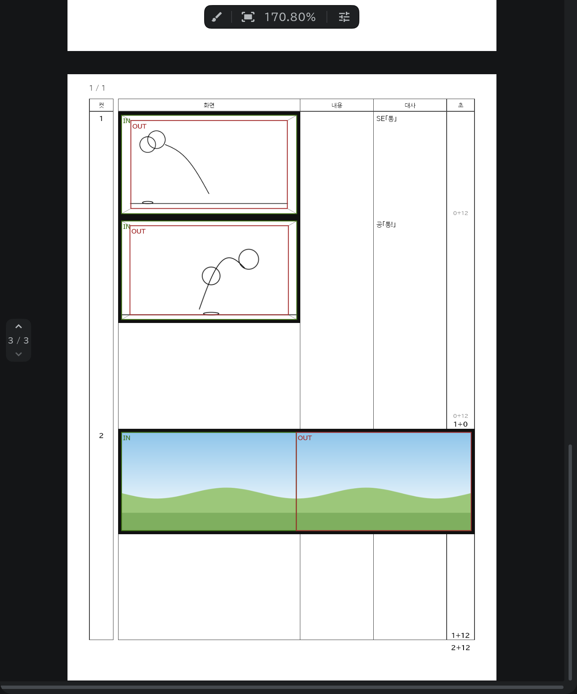

# 타임시트·콘티 용지

편집한 내용이 바로 반영되고, 실제로 출력되는 것과 같은 모습을 실시간으로 미리 봅니다.

- 화면 오른쪽 패널 위쪽 탭에서 **타임시트**·**콘티 용지** 를 고릅니다.
- 콘티 용지에는 종이처럼 바로 그립니다. 용지 위쪽의 **브러시 허용** 을 켜고 칸의 그림 자리에 그리면 그 컷의 콘티 그림이 됩니다.
- 타임라인에서 그림·대사·카메라를 바꾸면 그 자리에서 시트에 찍힙니다.
- 보이는 그대로 [출력](/ko/export)됩니다.
