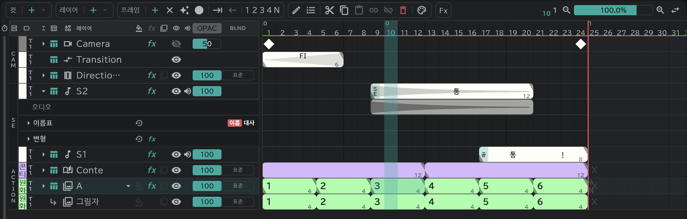

# 사운드 레이어

소리를 SE 줄에 놓고, 파형을 보며 그림과 타이밍을 맞춥니다.

- 왼쪽 위 **프로젝트**(폴더) → **가져오기/배치…** 로 소리 파일을 놓습니다.
- 줄 왼쪽 **▸** 로 펼치면 파형이 보입니다.
- SE 블록의 이름·대사는 [편집 버튼](/ko/timeline?id=편집-버튼)으로 넣고, [타임시트·콘티 용지](/ko/sheets)에 그대로 찍힙니다.
