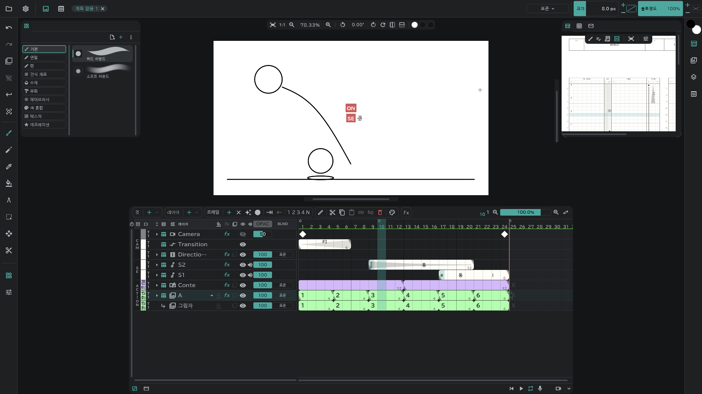
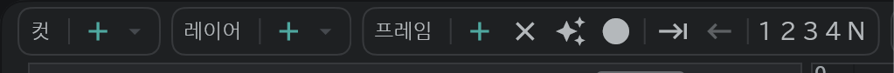

# 시작하기

공이 튀는 짧은 장면을 예로, 그리기까지 필요한 것만 적습니다.

## 컷과 레이어

- 타임라인 위쪽 **컷 ＋** 로 컷을, **레이어 ＋** 로 그림 레이어를 만듭니다.

## 프레임

- 레이어 줄에서 칸을 고르고 **프레임 ＋** 를 누르면 그 자리에 그림이 생깁니다.
- **✦**(빈 칸에 그리면 프레임 자동 생성)를 켜 두면 빈 칸에 그리기만 해도 생깁니다.

## 그리기

- 왼쪽 도구 막대에서 브러시를 고르고 캔버스에 그립니다. 브러시 종류는 왼쪽 위 목록에서 고릅니다.
- 크기와 불투명도는 화면 오른쪽 위에서 바꿉니다.

## 재생과 저장

- 타임라인 오른쪽 아래 **▶** 로 재생합니다.
- 왼쪽 위 **프로젝트**(폴더) 버튼 → **저장** 으로 저장합니다.

## 패널 크기

패널의 가장자리를 끌면 크기가 바뀝니다.

- 아래 패널(타임라인·콘티): 캔버스 쪽 가장자리로 높이, 양옆 가장자리로 폭. 양옆 가장자리를 두 번 누르면 기본 폭으로 돌아갑니다.
- 옆 패널: 캔버스 쪽 가장자리로 폭, 아래 가장자리로 높이. 같은 쪽 패널들은 폭을 함께 씁니다.
