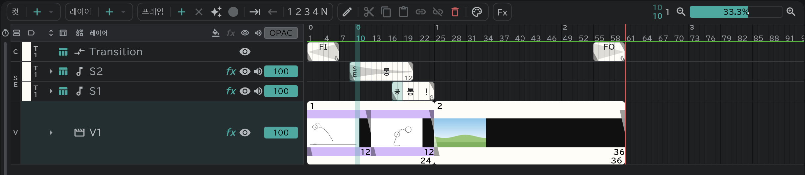

# 콘티

컷을 늘어놓은 공간입니다. V행이 각 컷을 의미하고, 독립된 크기를 가진 컷들을 재생할 수 있습니다.
콘티 작업시엔 컷 별로 콘티 레이어를 만들어 작업합니다. 콘티 레이어의 한 블록이 콘티 용지에서의 한 칸이 됩니다.

- **✦**(빈 칸에 그리면 프레임 자동 생성)를 켜 두면, 마지막 컷 다음 빈 줄에 그리기만 해도 다음 컷이 생깁니다.
