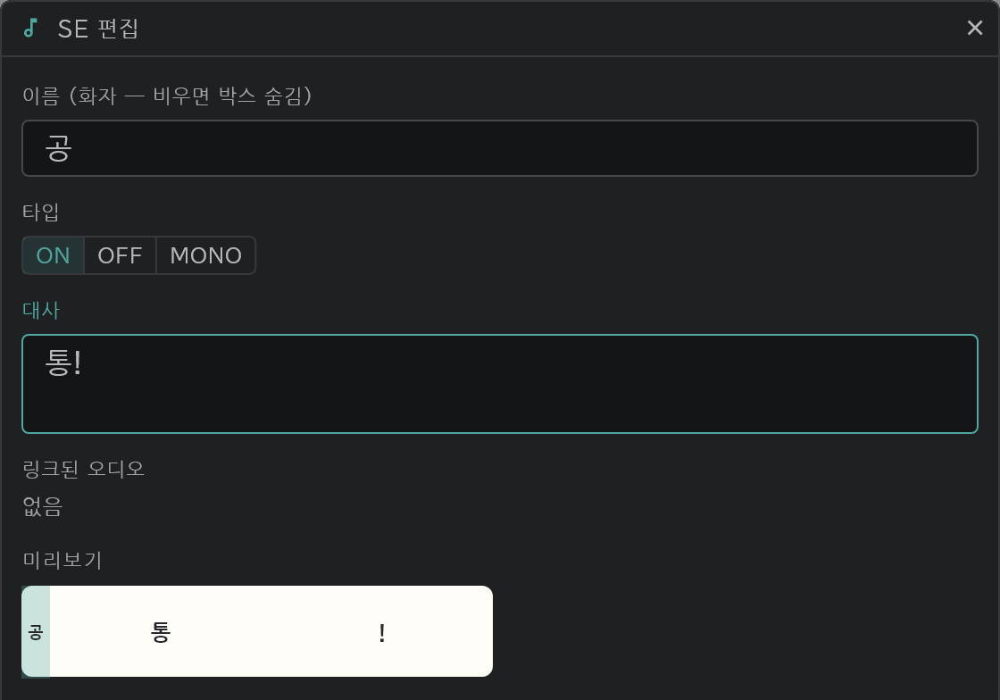

# 타임라인

한 줄이 레이어 하나, 가로가 시간(프레임)입니다.

- 위에서부터 **CAM**(카메라·트랜지션·디렉션), **SE**(소리·대사), 그 아래 **ACTION** 이 그림 레이어입니다.
- 블록 하나가 그림 한 장입니다. 큰 숫자는 그림 이름, 블록 끝의 작은 숫자는 그 블록의 길이(프레임 수)입니다.
- 줄 왼쪽의 색은 [색 라벨](/ko/layer-labels)입니다.
- 패널 왼쪽 아래 탭으로 타임라인과 [콘티](/ko/storyboard)를 바꿉니다.

## 선택과 이동

프레임·레이어·[콘티](/ko/storyboard) 패널의 컷 블록 모두 같습니다.

- 처음 드래그하면 **선택** 합니다(하나 또는 여러 개).
- 선택한 곳에서 다시 드래그하면 **이동** 합니다.

## 편집 버튼

블록을 고르고 위쪽의 **✎**(편집)를 누르면, 고른 대상에 맞는 창이 열립니다. 블록을 두 번 눌러도 같습니다.

- 그림 블록(그림·콘티·이미지 레이어): 그림 이름
- SE 블록: 이름(화자)·대사, 타입(ON·OFF·MONO), 링크된 오디오
- 디렉션 블록: 지시(PAN 등)
- 트랜지션 블록: 전환 종류(FI·FO 등). 길이는 블록 끝을 끌어서 바꿉니다.
- 카메라 같은 레인의 키: 키 이름
- 레이어를 고르면 레이어 이름(여러 개를 한 번에), [콘티](/ko/storyboard) 패널에서 컷을 고르면 컷 이름
