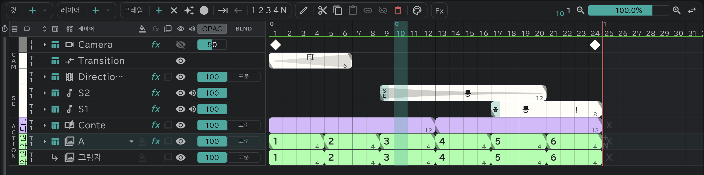

# 타임라인

한 줄이 레이어 하나, 가로가 시간(프레임)입니다.

- 위에서부터 **CAM**(카메라·트랜지션·디렉션), **SE**(소리·대사), 그 아래 **ACTION** 이 그림 레이어입니다.
- 블록 하나가 그림 한 장입니다. 큰 숫자는 그림 이름, 블록 끝의 작은 숫자는 그 블록의 길이(프레임 수)입니다.
- 줄 왼쪽의 색은 [색 라벨](/ko/layer-labels)입니다.
- 패널 왼쪽 아래 탭으로 타임라인과 [콘티](/ko/storyboard)를 바꿉니다.
